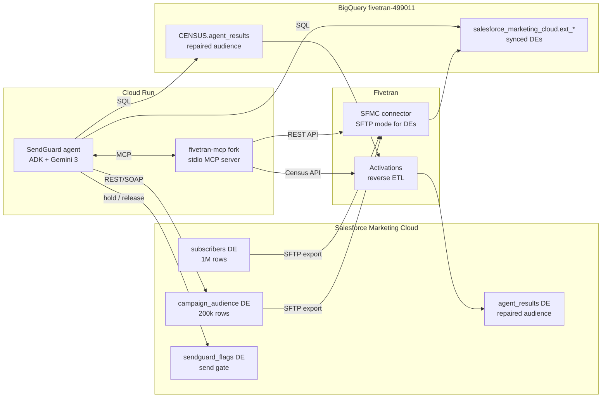

# SendGuard

**Fivetran moves the data. SendGuard makes sure you can trust it before you hit send.**

SendGuard is a pre-send validation agent for Salesforce Marketing Cloud (SFMC),
built with the Google Agent Development Kit (ADK) and Gemini for the Google
Cloud Rapid Agent Hackathon (Fivetran track).

Marketing teams routinely send campaigns on broken data: stale syncs, duplicate
subscribers, audiences containing unsubscribed contacts. SendGuard stands
between the marketer and the send button. Given a campaign about to go out, it
validates the audience data extension against the data warehouse, diagnoses
failures through the pipeline, repairs the audience, pushes the fix back to
SFMC via Fivetran Activations -- and only then clears the send.

## Architecture



**The flow.** The marketer asks: *"Campaign X is scheduled to send to audience
DE campaign_audience. Validate and clear it."* The agent then works through its
validation doctrine, narrating every step:

1. **Freshness** -- last Fivetran sync time vs. threshold; triggers a sync and
   waits if stale.
2. **Parity** -- SFMC DE row count (REST) vs. BigQuery table count; divergence
   means pipeline loss or post-sync edits.
3. **Integrity** -- in BigQuery: duplicate subscriber_keys, null emails,
   audience members flagged unsubscribed in the subscribers table.
4. **Verdict** -- PASS: release the send (after human approval). FAIL: hold the
   send, explain the defects in plain language, build a repaired audience
   (deduplicated, unsubscribed removed) in `CENSUS.agent_results`, push it back
   to SFMC via Fivetran Activations, verify landing, then release.

Every write action (sync trigger, repair, release) requires explicit human
approval in the conversation. Holding a send is the only unprompted write --
holding is always the safe direction.

## Repo layout

| Path | What it is |
|---|---|
| `agent/` | ADK agent: system prompt, BigQuery / SFMC tools, MCP toolset |
| `fivetran-mcp/` | Fork of [fivetran/fivetran-mcp](https://github.com/fivetran/fivetran-mcp), extended with Activations tools |
| `datagen/` | Synthetic data generator (1M subscribers, 1.5M events, 200k audience with planted defects) |
| `deploy/` | Dockerfile + Cloud Run deployment |
| `demo_script.md` | 3-minute demo video flow |

## Why FTP beats API for SFMC bulk data

The natural assumption is that a modern pipeline should pull data extensions
through SFMC's REST or SOAP APIs. In practice the API path collapses at bulk
scale, and SendGuard's pipeline deliberately uses Fivetran's **SFTP mode**:

- **It's not the call count -- it's the re-pull.** 2.5M rows at ~2,500 rows
  per page is only ~1,000 REST calls. But data extension rows expose no
  reliable change tracking, so there is no incremental sync: the API path
  re-pages *every row of every DE on every sync*. At six syncs a day that
  1,000 becomes 6,000 calls daily forever, scaling linearly with data volume
  and table count -- while a true enterprise tenant (tens of millions of rows,
  dozens of DEs) pushes into six figures.
- **Sequential latency.** Pagination is a serial walk -- each page waits for
  the last. At ~1-2s per call, one 2.5M-row table costs 20-40 minutes per
  sync, competing for tenant-wide rate limits with the production journeys and
  triggered sends you are trying to protect.
- **No snapshot isolation.** Paging a live table for half an hour means rows
  move between pages as marketers edit: silent duplicates and silent gaps --
  exactly the class of defect SendGuard exists to catch. A file export is an
  atomic snapshot: it lands complete and consistent, or not at all.
- **Fivetran's own connector abandoned the API path for data extensions.**
  The official SFMC connector pulls standard objects (subscribers, sends,
  events) via the API, but for data extensions it requires SFMC's Enhanced FTP:
  SFMC exports each DE to SFTP and Fivetran ingests the files. When the vendor
  whose entire business is moving data through APIs chooses file transfer for
  this object type, that is the strongest available evidence for the argument.

The irony is the point: the most reliable way to validate "modern" marketing
data is a battle-tested file drop, orchestrated by Fivetran, validated by an
agent.

## Setup

Prereqs: Python 3.12 (ADK does not yet support 3.14), gcloud CLI, a Fivetran
account with the SFMC connector + an Activations sync, an SFMC installed
package (Server-to-Server) with Data Extensions read/write scopes.

```bash
python3.12 -m venv .venv
.venv/bin/pip install -r requirements.txt

cp .env.example .env        # fill in every value
gcloud auth application-default login

# generate and import the demo data (SFMC import wizard, chunked CSVs)
.venv/bin/python datagen/generate_data.py --events-chunk-size 200000 --outdir datagen/output

# run the agent locally
.venv/bin/adk web agent
```

SFMC import notes:
- `campaign_audience` DE primary key MUST be `audience_row_id` (not
  `subscriber_key`), or SFMC dedupes away the planted duplicate defect.
- `engagement_events` DE primary key MUST be `event_id` -- event facts
  legitimately repeat subscriber_keys.
- Import part-files 002+ with action "Add and Update", never Overwrite.

## Deploy to Cloud Run

```bash
deploy/deploy.sh
```

See `deploy/` for the Dockerfile and the gcloud commands the script runs.

## License

Apache 2.0 -- see [LICENSE](LICENSE).
